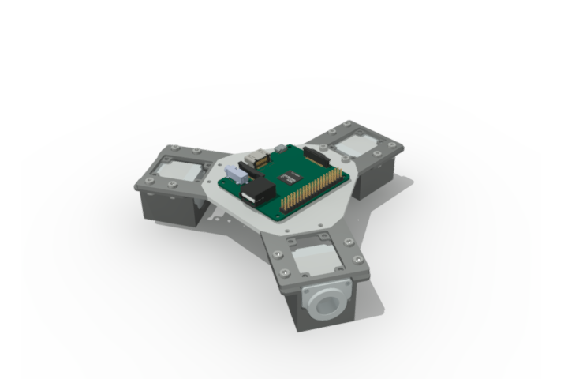
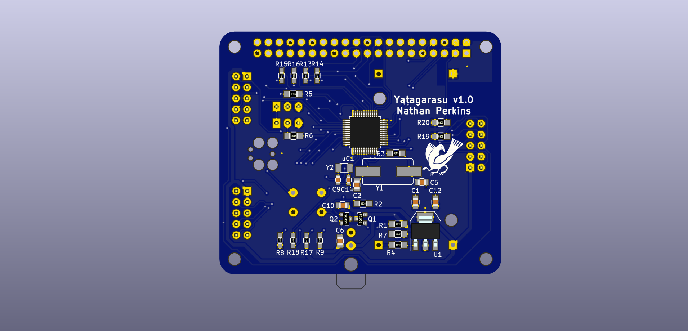

# OmniBot
EESS Modular Robotics Platform

An open source modular robotics platform designed with KiCAD and FreeCAD.
Custom designed Chassis designed to be laser cut/3d printed/CnC Milled. Custom fit stepper motor mounts with embedded motor controller PCB.

Main Processor unit consists of a Raspberry Pi A+ for path planning and general computation. An STM32 ARM microcontroller system controller will handle the stepper motor control via communication with the RPi A+ board and motor controllers. 
1: System Controller

Requirements: The Electronics design require the following footprint libraries for KiCAD

https://github.com/NathanielPerkins/NPFootprints.pretty

2: Mechanical
Chassis design for overall OmniBot frame, and motor mount system

3: Motor Controller

